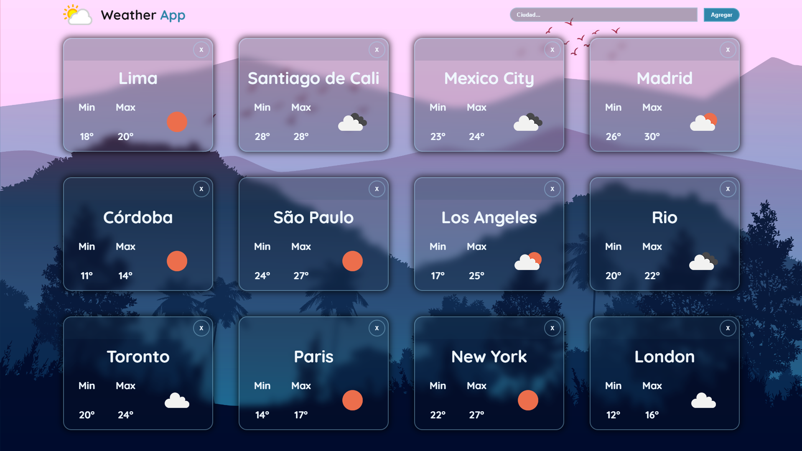

# __Weather App__

## __Introduction__
---

This is a basic project made with React that makes use of the API from https://openweathermap.org/api

You can find the weather status of different countries and cities, and view information about the maximum or minimum temperature.

#SoyHenry Bootcamp

## __Try out__
---

After clone this respository.
- Open the proyect console
- Inside, run the command line, `npm init` then `npm install`

## __Project screenshots__
---

